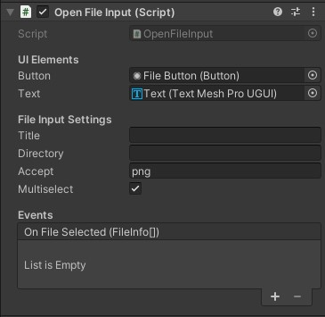
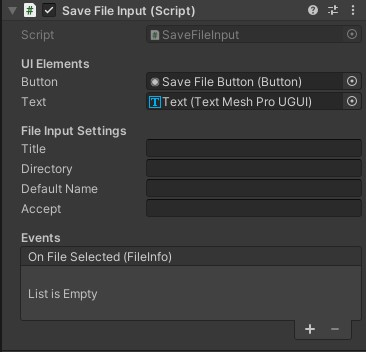
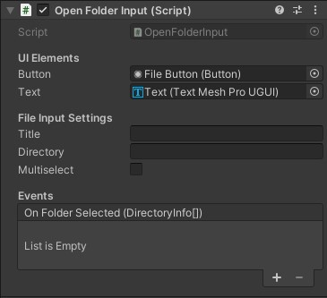

# Unity Standalone File Browser

A simple wrapper for native file dialogs on Windows/Mac/Linux.

- Works in editor and runtime.
- Open a file / folder, save file dialogs supported.
- Multiple file selection.
- File extension filter.
- Mono/IL2CPP backends are supported.
- Linux support by [Ricardo Rodrigues](https://github.com/RicardoEPRodrigues).
- Basic WebGL support.

## Installation

Open the Package Manager window, then click on the "+" icon in the top left corner,
then select the "Add Package from git URL..." and paste one of the following URL:

Install latest version (not recommended):

`https://github.com/Sov3rain/unity-standalone-file-browser.git?path=/Assets/UniStandaloneFileBrowser`

Install a specific version:

`https://github.com/Sov3rain/unity-standalone-file-browser.git?path=/Assets/UniStandaloneFileBrowser#v1.1.3`

## Example Usage

```csharp
using USFB;
using System.IO;

// Open file(s)
FileInfo[] files = StandaloneFileBrowser.OpenFilePanel("Open File", "", "png,jpg,jpeg", true);

// Open folder(s)
DirectoryInfo[] folders = StandaloneFileBrowser.OpenFolderPanel("Open Folder", "", false);

// Save file
FileInfo saved = StandaloneFileBrowser.SaveFilePanel("Save File", "", "MySaveFile", "txt");

// Async variants (callbacks are optional)
StandaloneFileBrowser.OpenFilePanelAsync("Open", "", "png,jpg", true, infos => Debug.Log(infos.Length));
StandaloneFileBrowser.SaveFilePanelAsync("Save", "", "MySave", "txt", info => Debug.Log(info?.FullName));
```

See Sample/BasicSampleScene.unity for more detailed examples.

### UI components

This package comes with 3 custom UI components, allowing you to easily and quickly implement File and Folder picking in your apps.

#### Open File Input

This component allows you to open a single file or multiple files. It is a simple wrapper around the OpenFilePanelAsync method. You can configure the title, directory, accepted file extensions and whether to allow multiple selection in the Inspector. You can also hook up to the `OnFileSelected` event to get the selected file(s).

You can get the selected files as an array of FileInfo objects using the property `Value` of the component:

```csharp
using USFB;
using System.IO;

public class MyClass : MonoBehaviour
{
    public OpenFileInput openFileInput;

    void Start()
    {
        openFileInput.OnFileSelected += OnFileSelected;
    }

    void OnFileSelected(FileInfo[] files)
    {
        Debug.Log(files.Length);
    }

    void LogSelectedFiles()
    {
        foreach (var file in openFileInput.Value)
        {
            Debug.Log(file.FullName);
        }
    }
}
```
**Inspector:**



#### Save File Input

This component allows you to pick a path to save a file. It is a simple wrapper around the SaveFilePanelAsync method. You can configure the title, directory, default file name and accepted file extension in the Inspector. You can also hook up to the `OnFileSelected` event to get the selected file.

You can get the selected file as a FileInfo object using the property `Value` of the component (see example above).

**Inspector:**



#### Open Folder Input

This component allows you to pick one or more folders. It is a simple wrapper around the OpenFolderPanelAsync method. You can configure the title, directory, and whether to allow multiple selection in the Inspector. You can also hook up to the `OnFolderSelected` event to get the selected folder(s).

You can get the selected folder(s) as an array of DirectoryInfo objects using the property `Value` of the component.

**Inspector:**



## Screenshots

Mac Screenshot


Windows Screenshot


Linux Screenshot


## Notes

### Windows
  
- Requires .NET 2.0 api compatibility level 
- Async dialog opening isn't implemented, Async method simply calls regular sync methods.
- Plugin import settings should be like this;
    
     

### Mac
  
- Sync calls are throws an exception at development build after the native panel loses and gains focus. Use async calls to avoid this.

### WebGL:

- Basic upload/download file support.
- File filter support.
- Not well-tested, probably not much reliable.
- Since browsers require more work to do file operations, webgl isn't directly implemented to Open/Save calls. You can check CanvasSampleScene. Unity and canvas sample scripts, for example, usages.
  
Live Demo: https://gkngkc.github.io/
